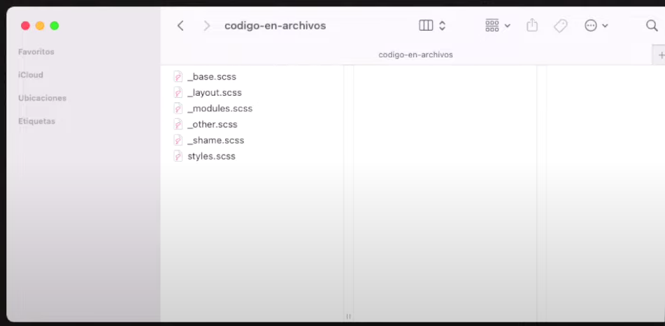
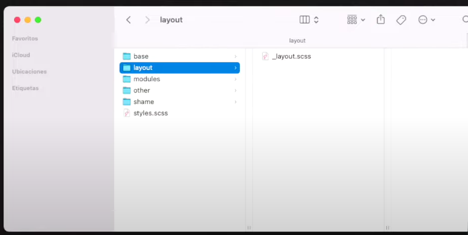
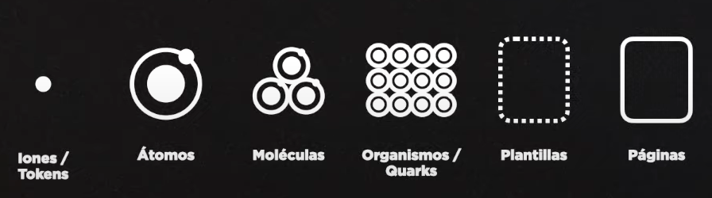
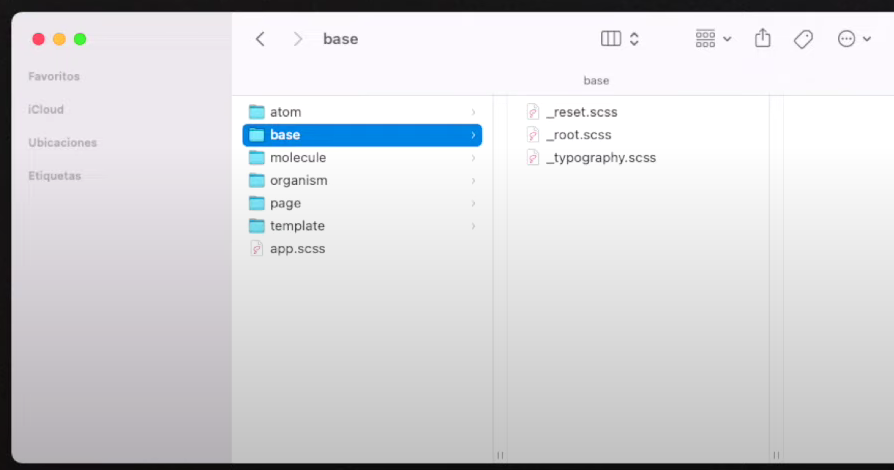
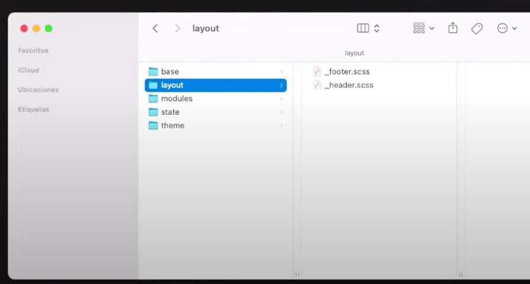

# Arquitectura en CSS

El objetivo de una arquitectura en CSS es la **organización del código y carpetas junto a una metodología de clases** para que el trabajo en equipo esté estandarizado.

Las arquitecturas en CSS estan pensadas para usarse con preprocesadores como SASS y LESS

# Advertencias

- Como no hay nada validado y "oficial" sobre esto, tanto metodologías como arquitecturas son "convenciones", es decir como un "pacto de piratas"

- Estas son las reglas oficiales, pero muchas veces las adaptamos y nos la saltamos.

# Arquitecturas existentes

- OOCSS
- ITCSS
- ACSS (Atomic Design)
- SMACSS
- BEMIT

De forma excepcional: SASS Pattern 7-1

# OOCSS

La arquitectura OOCSS proviene de la metodología BEM pero añadiendo 
una estructura de archivos.

Entonces usaremos cómo metodología de clases BEM pero usaremos una 
estructura de archivos concreta.

# Organización en OOCSS

En OOCSS podemos organizar sólo con múltiples archivos de estilo o 
usando diferentes carpetas que contienen los nombres de las clases.

Los nombres de los archivos y carpetas son:
- **styles:** que importa todos los archivos
- **__base:** con el reset de CSS
- **__modules:** estilos de los objetos o módulo (~bloques/contenedora)
- **__other:** es el código extra que complementa a módulos (~modificadores)
- **__shame** donde ponemos los arreglos de CSS que necesitamos hacer (~!important)

# Ejemplos de OOCSS
Si usamos la organización sólo con archivos nos quedaría algo así:

Si usamos la organización sólo con carpetas nos quedaría algo así:


# OOCSS: Ventajas y desventajas
Ventajas:
- Es fácil si ya conocías BEM
- Organización de archivos es fácil

Desventajas:
- El HTML nos queda con clases muy largas

# ITCSS
Esta basada en definir clases en base a funcionalidad y es muy usado en ReactJS y tiene 2 partes esenciales que debemos comprender:

- Organización de carpetas
- Organización de los nombres de las clases

# ITCSS: Organización de carpetas

ITCSS nos "obliga" a tener múltiples archivos de CSS / SCSS organizados
en diferentes carpetas que contienen los archivos con los nombres de 
las clases.

- **Settings** son las variables: font-size, colores, breakpoints...
- **Tools** son los mixin de SCSS sobre @media, clearfix...
- **Generic** las propiedades generales como el reset
- **Elements** apariencia con selectores de < tag >
- **Objects** apariencia con selectores de clases
- **Components** conjunto / agrupación de etiquetas
- **Utilities** son las excepciones de diseño (1 sola propiedad)

# ITCSS: Sintaxis de las clases 

En ITCSS no existe una nomenclatura de clases oficial, lo que implica
combinar con alguna metodología existente.

# Ventjas y desventajas de ITCSS

Ventajas:
- Organización del estilo de una etiqueta con clases
- Pensado para usar con preprocesadores (SCSS)

Desventajas:
- Muchas clases en muchos archivos diferentes

# ITCSS: Framework propio
Curiosamente en el caso de ITCSS existe un framework 
llamado INUITCSS que ya parte de esa arquitectura de CSS

# ACSS o Atomic CSS

Se le suele llamar Atomic Design CSS o Atomic CSS

Está basado en la filosofía de UX Atomic Design, donde se definen componentes desde lo 
más pequeño (iones) hasta las páginas completas.



# ACSS: Conceptos

Los conceptos del cual parte Atomic Design que representan a ciertos 
elementos:

- **Iones** Son las propiedades y valores básicos (.json)
- **Átomos** Son los iconos, botones o textos pequeños
- **Moléculas** Son botones con iconos, el botón de login de usuario
- **Organismos** Bloques de contenido: login de usuario con su formulario 
- **Plantillas** La estructura de una página, es decir todo con textofalso y sin imagen
- **Páginas** Es la plantilla con todos los textos e información

# ACSS: Nomenclaturas

Dentro de Atomic Design cada concepto tiene su nombre pero se pueden llamar diferente según dónde revises la documentación.

- **Iones** también se les llama **Tokens** o **Design Tokens**
- **Organismos** algunos los llaman **Quarks**
- **Organismos que envían o reciben datos** también se pueden llamar **Quarks**

# ACSS: Organización de carpetas

En Atomic CSS la estructura de carpetas se divide en los mismos conceptos donde por ejemplo:

- **Átomos** Guardamos los archivos CSS de los átomos
- **Utilidades** Guardamos el reset, clearfix, o medidas básicas



# ACSS: Workflow real

Cuando hablamos de ACSS debemos de tener en cuenta que no debemos de usarlos a lo loco.

Previamente debemos de hablarlo con el equipo de UX/UI para que el diseño que haga se ajuste con la forma de crear carpetas y organizar los elementos en el equipo de desarrollo.

No es una arquitectura pensada para usar nosotros a la ligera, es decir **no la apliques tú solo/a.**

# ACSS: Sintaxis de las clases

La nomenclatura de las clases es más compleja de lo habitual igual que su forma de trabajo.

Se diferencian entre:

- Eje X Referencia a left y right
- Eje Y Referencia a top y bottom

En HTML las clases ya tienen una nomenclatura dónde comienzan con la propiedad y el valor entre paréntesis.

En CSS ciertos caracteres necesitan del "slash invertido" para tratar los "espacio" y "#" como texto.

# ACSS: Ejemplo en HTML

Aquí un ejeplo real para escribir un color:

- Es el nombre de la clase, una versión resumida de la propiedad **Color**

- Es el valor de la propiedad y se usa entre paréntesis

```html
<h1 class="C(#FFFFFF)">Saludos</h1>
```
# ACSS: Ejemplo en CSS

Aquí un ejemplo real para escribir un background color:

- El "slash invertido" sirve para que CSS interprete los caracteres como texto. Ejemplo el # no es un ID es una "letra"

```css
.C\(\#FFFFFF\){
    color: #ffffff;
}
```

# ACSS: Lista de las clases

Ejemplo de algunas clases en ACSS:

| Clase  | Propiedad  | 
| ------------ | ------------ | 
|  Bgc(#FFF)  | Background-color  |
|  C(#FFF)  | Color  |
|  M(20px)  | Margin en todos los ejes (top, left, right y bottom)  |
|  My(20px)  | Margin en el eje y (top y bottom)  |
|  Mx(20px)  | Margin en el eje x (left y right)  |

# Ventajas y desventajas de ACSS

Ventajas:

- Organización con el equipo de UX/UI
- Antes de programar ya sabemos qué clases usaremos

Desventajas:

- Debemos de usarlo junto a un equipo UX/UI
- La sintaxis en CSS es un infierno

# SMACSS

SMACSS es una arquitectura que se centra en 5 categorías básicas pensando para usar con frameworks ya que contempla el uso de State.

Web oficial (libro oficial): http://smacss.com

# SMACSS: Conceptos

El concepto de SMACSS se basa en estructurar la web o app en módulos y en su estructura (layout) por tanto las categorías son:

- **Base** es el reset y selectores generales de la web
- **Layout** es la estructura general de la web
- **Modules** Son los elementos reutilizables de la web
- **State** Es el estado de cada módulo
- **Theme** Son los colores y el estilo de los módulos

# SMACSS: Organización de carpetas

La organización de carpetas se mantiene igual que los conceptos bajo los que está construida, es decir la estructura de carpeta es:



# SMACSS: Sintaxis de las clases

En las clases podemos usar id y class y la nomenclatura es Kebab Case para nombrarlos.

- **Base**
- **Layout** Los nombres de header o footer van con ID
- **Modules** Usamos clases para los nombres
- **State** Usamos clases con doble guión --
- **Theme** Usamos claes para los nombres

# Ventajas y desventajas SMACSS

SMACSS es una arquitectura bastante documentada y tiene en cuenta muchos posibles cambios, aún así:

Ventajas:

- Organización simple de carpetas
- Organización simple de clases

Desventajas:
- Uso de ID como selector (Perdida de rendimiento)
- Uso del nombre de la etiqueta como selector (Perjudica SEO)

# Caso especial: BEMIT

Es la metodología BEM pero con la organización de carpetas ITCSS.

Es decir, que combinamos tanto metodologías como arquitectura para organizar nuestro código.