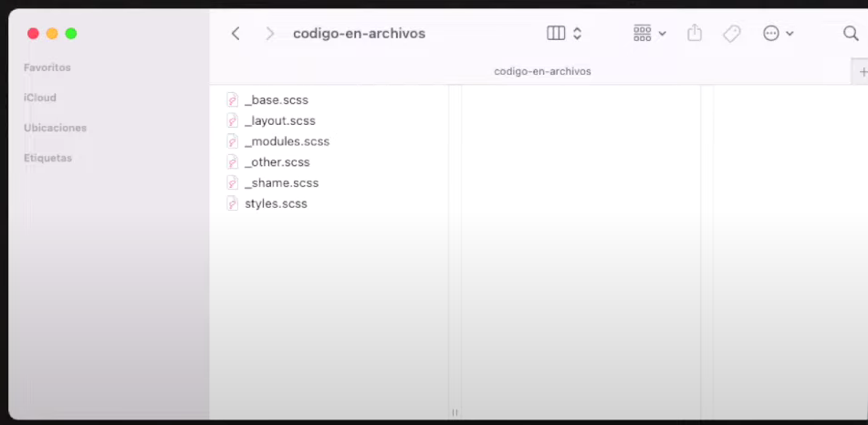
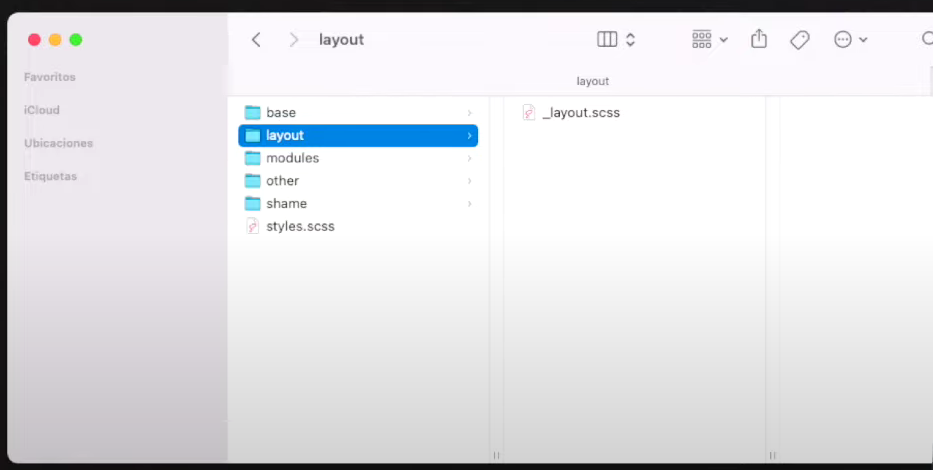

# Arquitectura en CSS

El objetivo de una arquitectura en CSS es la **organización del código y carpetas junto a una metodología de clases** para que el trabajo en equipo esté estandarizado.

Las arquitecturas en CSS estan pensadas para usarse con preprocesadores como SASS y LESS

# Advertencias

- Como no hay nada validado y "oficial" sobre esto, tanto metodologías como arquitecturas son "convenciones", es decir como un "pacto de piratas"

- Estas son las reglas oficiales, pero muchas veces las adaptamos y nos la saltamos.

# Arquitecturas existentes

- OOCSS
- ITCSS
- ACSS (Atomic Design)
- SMACSS
- BEMIT

De forma excepcional: SASS Pattern 7-1

# OOCSS

La arquitectura OOCSS proviene de la metodología BEM pero añadiendo 
una estructura de archivos.

Entonces usaremos cómo metodología de clases BEM pero usaremos una 
estructura de archivos concreta.

# Organización en OOCSS

En OOCSS podemos organizar sólo con múltiples archivos de estilo o 
usando diferentes carpetas que contienen los nombres de las clases.

Los nombres de los archivos y carpetas son:
- **styles:** que importa todos los archivos
- **__base:** con el reset de CSS
- **__modules:** estilos de los objetos o módulo (~bloques/contenedora)
- **__other:** es el código extra que complementa a módulos (~modificadores)
- **__shame** donde ponemos los arreglos de CSS que necesitamos hacer (~!important)

# Ejemplos de OOCSS
Si usamos la organización sólo con archivos nos quedaría algo así:

Si usamos la organización sólo con carpetas nos quedaría algo así:

# OOCSS: Ventajas y desventajas
Ventajas:
- Es fácil si ya conocías BEM
- Organización de archivos es fácil

Desventajas:
- El HTML nos queda con clases muy largas

# ITCSS
Esta basada en definir clases en base a funcionalidad y es muy usado en ReactJS y tiene 2 partes esenciales que debemos comprender:

- Organización de carpetas
- Organización de los nombres de las clases

# ITCSS: Organización de carpetas

ITCSS nos "obliga" a tener múltiples archivos de CSS / SCSS organizados
en diferentes carpetas que contienen los archivos con los nombres de 
las clases.

- **Settings** son las variables: font-size, colores, breakpoints...
- **Tools** son los mixin de SCSS sobre @media, clearfix...
- **Generic** las propiedades generales como el reset
- **Elements** apariencia con selectores de < tag >
- **Objects** apariencia con selectores de clases
- **Components** conjunto / agrupación de etiquetas
- **Utilities** son las excepciones de diseño (1 sola propiedad)

# ITCSS: Sintaxis de las clases 

En ITCSS no existe una nomenclatura de clases oficial, lo que implica
combinar con alguna metodología existente.

# Ventjas y desventajas de ITCSS

Ventajas:
- Organización del estilo de una etiqueta con clases
- Pensado para usar con preprocesadores (SCSS)

Desventajas:
- Muchas clases en muchos archivos diferentes

# ITCSS: Framework propio
Curiosamente en el caso de ITCSS existe un framework 
llamado INUITCSS que ya parte de esa arquitectura de CSS

# ACSS o Atomic CSS

