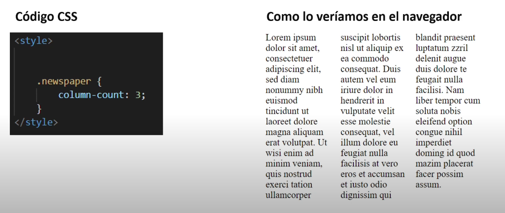
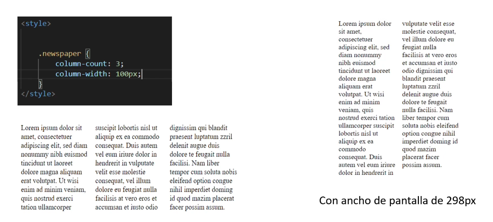
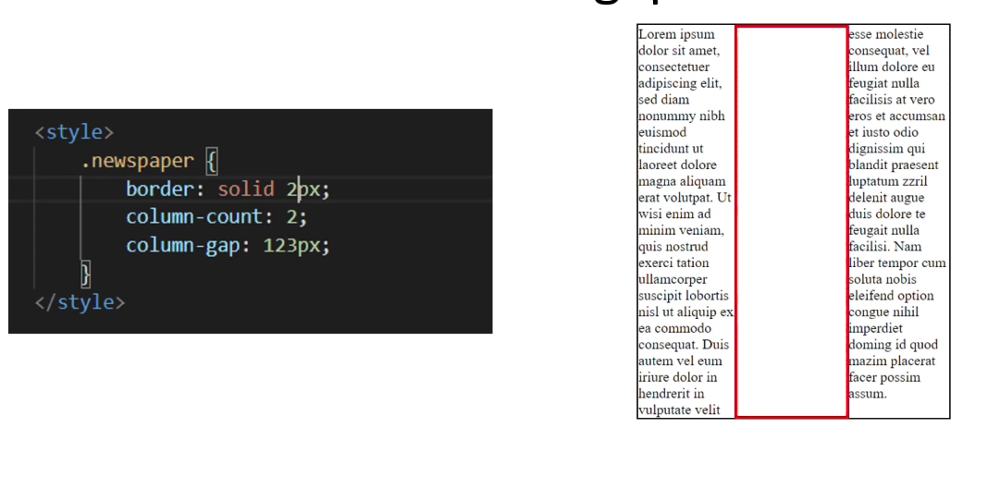
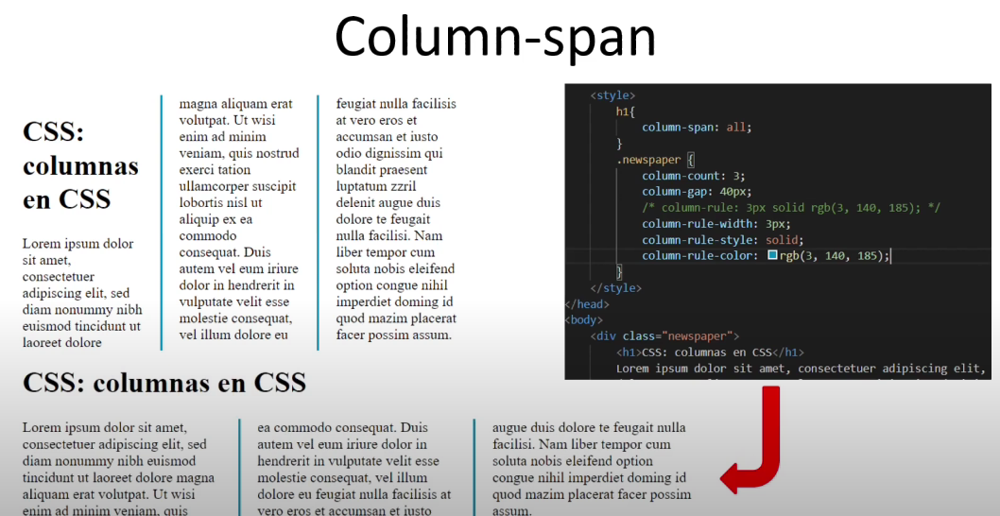

# diseño en columnas

Nos permite una facil definición de multiples columnas de texto parecido a un periodico, revista.

Las propiedades que nos sirven para manejar un diseño de columnas son:

- column-count nos permite indicar el número de columnas en las que se debe de dividir un elemento.
- column-width nos permite definir cual va a ser el ancho de cada columna.
- column-gap especifica el espacio entre columnas 
- column-rule crea un borde con las mismas propiedades que border se puede separar en tres propiedades 
- column-span sirve para que abarque todo el espacio con el valor all

 
 

