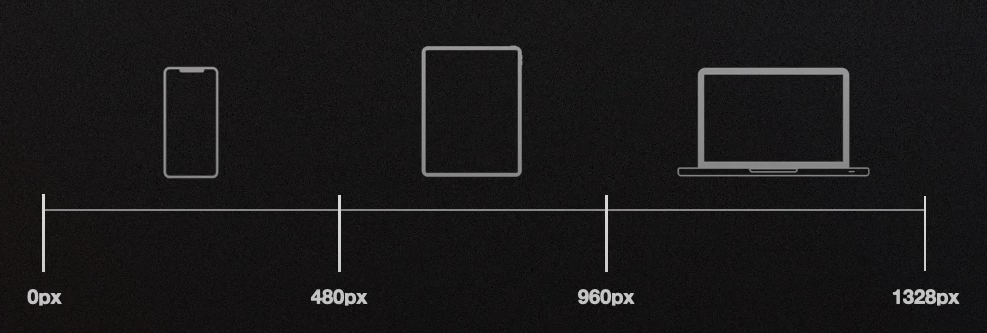
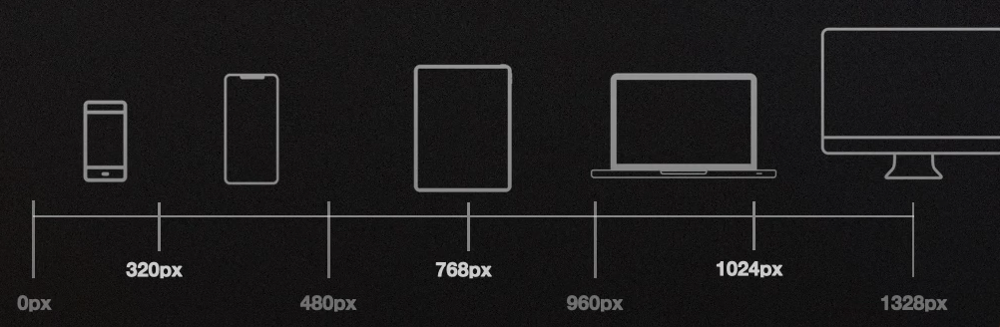

# Responsive design

Hacemos que una web se vea correctamente independientemente del dispositivo desde el que se 
visualiza; es decir, se "adapta" a todas las resoluciones.

Existen 2 conceptos esenciales:

- Breakpoints
- Media Queries

Se puede aplicar en:

- HTML
- CSS

# Breapoints

"Breakpoints" o "puntos de corte" son los puntos donde parte de la estructura de una web cambia/
reemplaza/añade propiedades CSS para adaptarse.

Deben de servir como **referencia** ya que en un futuro nos crearemos nuestros propios puntos 
de corte.

Y vamos a definir varios tipos de breakpoints:

- De resolución (clásico)
- De dispositivo

# Breakpoints de resolución

En los breakpoints de resolución tenemos en cuenta el ancho en píxeles del dispositivo.

Es decir, dependiendo de si el dispositivo es un móvil, tablet u ordenador existen diferentes 
breakpoints.

Vamos a definir 3 tipos:

- básicos
- completos
- personalizados

# Breakpoints básicos

En terminos generales todos los móviles, tabletas y webs suelen encontrarse con ciertos 
breakpoints que nos permiten hacer un diseño responsive general.

Cuidado con las tabletas ya que tienen muchas variantes.

# Breakpoints completos

Si queremos ser más específicos podemos definir más breakpoints recomendados dependiendo de los 
diferentes dispositivos.

Esto es muy útil para definir móviles pequeños o diferentes tamaños de tableta u ordenadores 
con monitores muy grandes, tv.

# Breakpoints personalizados

Cuando estamos creando una web, muchas veces necesitamos crear breakpoints que nos permiten en base a nuestro propio diseño / maquetación modificar algún comportamiento en alguna resolución muy concreta.

Trucos:

- Revisar Google Analytics de tu web
- Revisar https://gs.statcounter.com

# Breakpoints de dispositivo

Cuando hablemos de breakpoints del dispositivo nos referimos de breakpoints que tienen en 
cuenta el comportamiento del propio dispositivo.

- Orientación
- Modo Oscuro
- Pantalla o Impresión

Lista completa de breakpoints de dispositivo:
https://developer.mozilla.org/es/docs/Learn/CSS/CSS_layout/Responsive_Design

# Donde usar breakpoints

Es **esencial** comprender porqué los breakpoints son importantes pero se usan en dos lugares 
diferentes

- HTML: en el atributo media=""
- CSS: en la regla @media