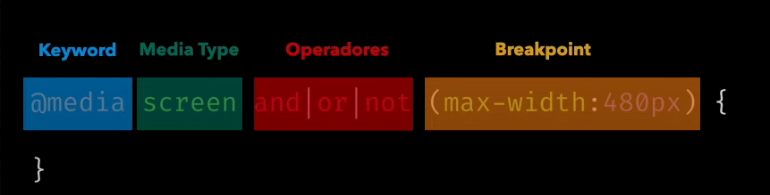
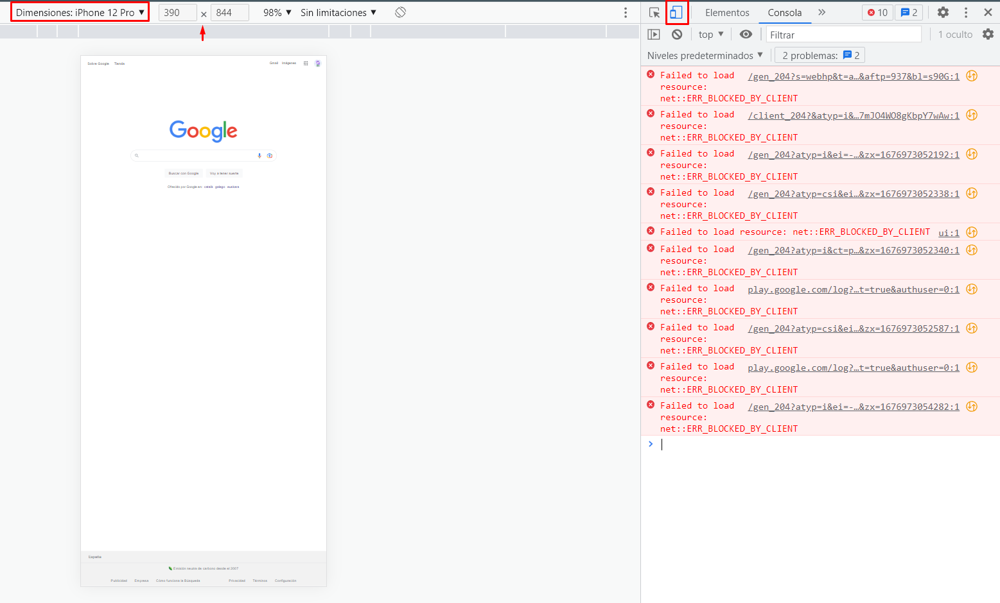

# Media Query

Una media query es una declaración en CSS que nos permite definir mediante los breackpoints en qué píxeles las 
propiedades de un elemento van a cambiar.

Normalmente las webs tienen varias media query dependiendo de qué cambios queremos que tenga nuestra web.

# Sintaxis

Una media query tiene múltiples partes que debemos conocer.

- Regla o palabra reservada
- Media Type
- Operadores
- Breakpoint o Media Feature



# @media en CSS

@media en CSS es una palabra reservada para poder hacer Responsive Design y es esencial usarla.

Es una **regla** introducida en CSS3 junto a otras reglas como @font-face.

# Media Screen

Como hemos visto el screen es un breakpoint de dispositivo o en inglés un media type y es 
esencial escribirlo por temas de compatibilidad.

Hace años existían muchos media types:

- Print (en caso de querer imprimir una página web) a día de hoy no es tan habitual pero se sigue usando
- Braille (obsoleto)

# Cómo usar una media query

Las media query sobreescriben las propiedades CSS así que para usarlas existen varios trucos:

- Colocarlas siempre al final del archivo CSS 
- Deben de tener el mismo selector
- Pensar bien los breakpoints previamente

Tips:
- Usar una metodología CSS como BEM 

Un ejemplo sencillo del uso de una media query sería este:

```css
/* El color del texto en otros dispositivos */
.h2{
    color: black;
}
/* El color del texto SOLO en la versión mobile */
@media screen and (max-width:480px){
    .h2{
        color: grey;
    }
}

```

# Cómo usar el @media en HTML

Dentro de HTML también se usa el @media, aunque se escribe en forma de atributo.

Se usa en etiquetas como:

- Etiqueta < link > (No recomendado, era como se hacía el responsive antes hace muchos años)
- Etiqueta < style > (No recomendado, lo recomendable es usar siempre css en arhcivos separados)
- Etiqueta < picture > (cambiar la imágen que se muestra segun la resolución del dispositivo)

Ejemplo:

```html
<picture>
    <source srcset="imagenMovil.jpg" media="screen and (max-width:480px)">
    
</picture>
```

# Qué es una etiqueta viewport

Usamos la etiqueta <meta> para configurar el viewport del dispositivo que estemos usando 
evitando que hagan una escala y configurando el ancho de la web como el dispositivo sin importar
su resolución.

Siempre debe de estar ya que configura la forma de ver el navegador en otros dispositivos.

```html
<meta name="viewport" content="width=device-width, initial-scale=1.0" />
```

# Trucos para Responsive

Revisa siempre y aprende estos trucos para evitar tener que hacer muchos breakpoints:

- No usar altura en las etiquetas (si tenemos que poner altura poner min-height) si ponemos altura nos fuerza a tener que poner más @medias
- Usar siempre medidas en porcentajes, vw, vh si acaso usar em o rem
- Calcular bien los anchos usando calc() o margin 
- Intentar usar, flex o grid si el proyecto lo permite

# Comprobar bien tu diseño responsive

En el día a día puedes usar 2 técnicas para comprobar tu responsive design:

- Mediante el navegador (día a día)
- Comprobación de verdad

# Mediante el navegador

En cada navegador, dentro del inspector de elementos tenemos el sistema de vista responsive.



# Comprobarlo de verdad

La comprobación "de verdad" es la comprobación que deberíamos de tener realmente en cuenta.
Muchas veces las webs se rompen en dispositivos reales pero en el inspector no.

Puedes hacerlo mediante:

- Apps como Prepros o CodeKit
- Live Server (xamp, extensión live server visual studio code)